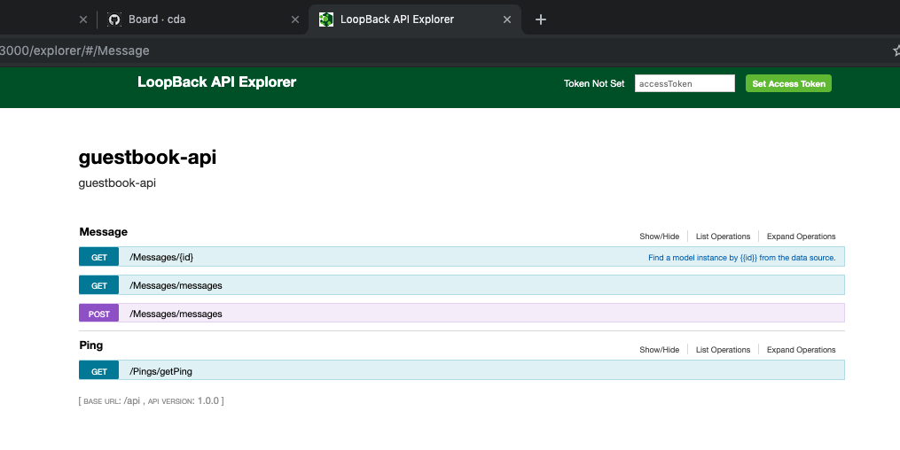

# Lab0 - Create the Guestbook API App using Loopback 3 and OpenAPI version 2.0

1. Pre-requirements

	* Loopback 3 CLI
	* IBM Cloud CLI

2. Create the Guestbook API template,

	* Create the Loopback 3 project for the Guestbook API as an `api-server`,

		```console
		$ lb guestbook-api
		? What's the name of your application? guestbook-api
		? Enter name of the directory to contain the project: guestbook-api
		create guestbook-api/
			info change the working directory to guestbook-api

		? Which version of LoopBack would you like to use? 3.x (Active Long Term Support)
		? What kind of application do you have in mind? api-server (A LoopBack API server with local User auth)
		Generating .yo-rc.json

		I'm all done. Running npm install for you to install the required dependencies. If this fails, try running the command yourself.

		  create .editorconfig
		  create .eslintignore
		  create .eslintrc
		  create server/boot/root.js
		  create server/middleware.development.json
		  create server/middleware.json
		  create server/server.js
		  create README.md
		  create server/boot/authentication.js
		  create .gitignore
		  create client/README.md
		npm WARN deprecated swagger-ui@2.2.10: No longer maintained, please upgrade to swagger-ui@3.
		npm WARN deprecated circular-json@0.3.3: CircularJSON is in maintenance only, flatted is its successor.
		npm notice created a lockfile as package-lock.json. You should commit this file.
		added 407 packages from 437 contributors and audited 2435 packages in 9.111s
		found 3 moderate severity vulnerabilities
		run `npm audit fix` to fix them, or `npm audit` for details

		Next steps:

		Change directory to your app
			$ cd guestbook-api

		Create a model in your app
			$ lb model

		Run the app
			$ node .
		```

	* Change directory to your app,

		```console
		$ cd guestbook-api
		```

	* Create a new file `Dockerfile` in the project root directory, and add the following code,

		```text
		FROM node:10-slim

		USER node

		RUN mkdir -p /home/node/app
		WORKDIR /home/node/app

		COPY --chown=node package*.json ./
		RUN npm install
		COPY --chown=node . .

		ENV HOST=0.0.0.0 PORT=3000

		EXPOSE ${PORT}
		CMD [ "node", "." ]
		```

	* Run the app on port 3000,

		```console
		$ PORT=3000 npm start
		> guestbook-api@1.0.0 start /Users/user1/dev/guestbook-api
		> node .

		Web server listening at: http://localhost:3000
		Browse your REST API at http://localhost:3000/explorer
		```

	* Run the app with Docker,

		```console
		$ docker stop guestbook-api
		$ docker rm guestbook-api
		$ docker build --no-cache -t guestbook-api .
		$ docker run -d --restart always --name guestbook-api -p 3000:3000 guestbook-api
		```

	* Open the application at http://localhost:3000/explorer

		```console
		$ open http://localhost:3000/explorer
		```

3. Create the OpenAPI spec for the Guestbook API,

	* The current version of Loopback is version 4, which exposes an OpenAPI spec version 3. the OpenAPI spec version 3 however is only partially supported by APIConnect. For that reason I will use OpenAPI spec or Swagger version 2. To support Swagger version 2.0, I will use Loopback 3 to generate the supporting artifacts.
  
	* The following points first explain the different parts of the OpenAPI spec to be created, then the complete OpenAPI spec is listed:

    	1. The data model of the Guestbook API app can be represented in the `definitions` section of the OpenAPI spec. I want to add representation for the following objects:
        	* Message
        	* Person
        	* Contact
        	* Address

    	2. I want to add endpoints to support,
        	* Health:
            	* GET /ping
        	* Messages:
            	* GET /messages
            	* GET /messages/{id}
            	* POST /messages

    	3. Add API Connect context variables,

    		* You can add context variables for the IBM DataPower Gateway in API Connect by using the [IBM extensions to the OpenAPI (Swagger 2.0) specification](https://www.ibm.com/support/knowledgecenter/en/SSFS6T/com.ibm.apic.toolkit.doc/rapim_cli_swagger_extensions.html) with `x-ibm-configuration`. To define properties in an API use the [`properties` extension](https://www.ibm.com/support/knowledgecenter/SSFS6T/com.ibm.apic.toolkit.doc/rapim_cli_properties.html),

    		* To use the `guestbook-cvs-url` in the `Invoke` action of an assembly, you use the templating syntax `$()`. To inject the `guestbook_svc_url` as the URL property of the `Invoke` action in the assembly, use `http://$(guestbook_svc_url)/$(request.uri)`.

	* The above requirements can be represented in the OpenAPI spec or Swagger 2.0 as follows using JSON format, create a new file `api/guestbook-api-swagger.json` and paste the following JSON,

		```json
		{
			"swagger": "2.0",
			"info": {
				"title": "Guestbook API",
				"description": "Guestbook API provides an API for the Guestbook application",
				"version": "1.0.0"
			},
			"host": "169.63.218.104:32145",
			"basePath": "/",
			"schemes": [
				"https"
			],
			"paths": {
				"/messages": {
					"get": {
						"tags": [
							"Message"
						],
						"produces": [
							"application/json"
						],
						"responses": {
							"200": {
								"description": "Array of Message model instances",
								"schema": {
									"type": "array",
									"items": {
									"$ref": "#/definitions/Message"
									}
								}
							}
						},
						"operationId": "getMessages"
					},
					"post": {
						"tags": [
							"Message"
						],
						"consumes": [
							"application/json"
						],
						"produces": [
							"application/json"
						],
						"parameters": [
							{
								"name": "message",
								"description": "new Message",
								"in": "body",
								"schema": {
									"type": "object",
									"$ref": "#/definitions/Message"
								}
							}
						],
						"responses": {
							"201": {
								"description": "Message model instance",
								"schema": {
									"$ref": "#/definitions/Message"
								}
							}
						},
						"operationId": "addMessage"
					}
				},
				"/ping": {
					"get": {
						"tags": [
							"Ping"
						],
						"summary": "Does a ping check to see if the server is up",
						"responses": {
							"200": {
								"description": "Ping Response",
								"schema": {
									"$ref": "#/definitions/Ping"
								}
							}
						}
					}
				}
			},
			"definitions": {
				"Message": {
					"title": "Message",
					"properties": {
						"id": {
							"type": "number"
						},
						"text": {
							"type": "string"
						},
						"datecreated": {
							"type": "string",
							"format": "date-time"
						}
					},
					"required": [
						"text"
					]
				},
				"Person": {
					"title": "Person",
					"properties": {
						"id": {
							"type": "number"
						},
						"firstname": {
							"type": "string"
						},
						"lastname": {
							"type": "string"
						},
						"username": {
							"type": "string"
						}
					}
				},
				"Contact": {
					"title": "Contact",
					"properties": {
						"id": {
							"type": "number"
						},
						"email": {
							"type": "string"
						},
						"phone": {
							"type": "string"
						}
					}
				},
				"Address": {
					"title": "Address",
					"properties": {
						"id": {
							"type": "number"
						},
						"addressline1": {
							"type": "string"
						},
						"addressline2": {
							"type": "string"
						},
						"city": {
							"type": "string"
						},
						"state": {
							"type": "string"
						},
						"zipcode": {
							"type": "string"
						},
						"country": {
							"type": "string"
						}
					}
				},
				"Ping": {
					"title": "Ping",
					"properties": {
						"greeting": {
							"type": "string"
						},
						"date": {
							"type": "string"
						},
						"url": {
							"type": "string"
						}
					}
				}
			},
			"x-ibm-configuration": {
				"properties": {
					"guestbook_svc_url": {
					"value": "http://69.63.218.104:32145",
					"description": "Location of the Guestbook API service",
					"encoded": false
					}
				}
			}
		}		
		```

	* Note that in the above OpenAPI spec I have used the address `http://69.63.218.104:32145`, which is the public IP of the worker node and the nodePort of the service exposing the Guestbook API deployment. However, we have not yet deployed our Guestbook API app, we will have to change the values of the host and service url for the API Connect proxy.


4. Generate the Loopback application artifacts from the OpenAPI spec version 2.0,

	```console
	$ lb swagger
	? Enter the swagger spec url or file path: ./api/guestbook-api-swagger.json
	Loading ./api/guestbook-api-swagger.json...
	? Select models to be generated: (Press <space> to select, <a> to toggle all, <i> to inverse selection)Message, Person, Contact, Address, Ping
	? Select the datasource to attach models to: db (memory)
	Creating model definition for Message...
	Creating model definition for Person...
	Creating model definition for Contact...
	Creating model definition for Address...
	Creating model definition for Ping...
	Model definition created/updated for Message.
	Model definition created/updated for Contact.
	Model definition created/updated for Person.
	Model definition created/updated for Ping.
	Model definition created/updated for Address.
	Creating model config for Message...
	Creating model config for Person...
	Creating model config for Contact...
	Creating model config for Address...
	Creating model config for Ping...
	Model config created for Message.
	Model config created for Person.
	Model config created for Contact.
	Model config created for Address.
	Model config created for Ping.
	Generating /Users/user1/dev/guestbook-api/common/models/message.js
	Generating /Users/user1/dev/guestbook-api/common/models/ping.js
	Models are successfully generated from swagger spec.
	```

5. Add relations to models running the `lb relation` command to create the following 3 model relations,

	```console
	$ lb relation
	? Select the model to create the relationship from: Person
	? Relation type: has many
	? Choose a model to create a relationship with: Message
	? Enter the property name for the relation: messages
	? Optionally enter a custom foreign key: messageId
	? Require a through model? No
	? Disable the relation from being included: No

	$ lb relation
	? Select the model to create the relationship from: Person
	? Relation type: has one
	? Choose a model to create a relationship with: Contact
	? Enter the property name for the relation: contacts
	? Optionally enter a custom foreign key: contactId
	? Disable the relation from being included: No

	$ lb relation
	? Select the model to create the relationship from: Contact
	? Relation type: has one
	? Choose a model to create a relationship with: Address
	? Enter the property name for the relation: addresses
	? Optionally enter a custom foreign key: addressId
	? Disable the relation from being included: No
	```

8. Add Implementation to the Controller,

	* Edit the file `common/models/message.js` and replace the default error handling code, by the implementation logic for `GET /messages` and `POST messages`,

		```javascript
		  Message.getMessages = function(callback) {
			console.log('=====>getMessages');
			Message.find((err, messages) => {
			if (err) {
				console.log(err);
				callback(err);
			}
			console.log(messages);
			callback(null, messages);
			});
		  };

		  ...

		  Message.addMessage = function(message, callback) {
			console.log('=====>addMessage');
			Message.create(message, (err, newMessage)=>{
			if (err) {
				console.log(err);
				callback(err);
			}
			console.log(newMessage);
			callback(null, newMessage);
			});
		  };
		```
   * Edit the file `common/models/ping.js` and replace the default error handling code, by the implementation logic for `GET /ping`,

		```javascript
		Ping.getPing = function(callback) {
			let msg = {
				'greeting': 'The server is UP and running!',
			};
			callback(null, msg);
		};
		```

9. Disable RemoteMethods and User Model

	* To hide specific endpoints for Message, add the following methods to the `common/models/message.js`,

		```javascript
		module.exports = function(Message) {

		  Message.disableRemoteMethod('patchOrCreate', true);
		  Message.disableRemoteMethod('find', true);
		  Message.disableRemoteMethod('replaceOrCreate', true);
		  Message.disableRemoteMethod('create', true);
		  Message.disableRemoteMethod('updateAttributes', false);
		  Message.disableRemoteMethod('replaceById', true);
		  Message.disableRemoteMethod('exists', true);
		  Message.disableRemoteMethod('deleteById', true);
		  Message.disableRemoteMethod('createChangeStream', true);
		  Message.disableRemoteMethod('count', true);
		  Message.disableRemoteMethod('findOne', true);
		  Message.disableRemoteMethod('updateAll', true);
		  Message.disableRemoteMethod('upsertWithWhere', true);
		```

	* To hide specific endpoints for Ping, add the following methods to the `common/models/ping.js`,

		```javascript
		module.exports = function(Ping) {

		  Ping.disableRemoteMethod('patchOrCreate', true);
		  Ping.disableRemoteMethod('find', true);
		  Ping.disableRemoteMethod('replaceOrCreate', true);
		  Ping.disableRemoteMethod('create', true);
		  Ping.disableRemoteMethod('updateAttributes', false);
		  Ping.disableRemoteMethod('replaceById', true);
		  Ping.disableRemoteMethod('exists', true);
		  Ping.disableRemoteMethod('deleteById', true);
		  Ping.disableRemoteMethod('createChangeStream', true);
		  Ping.disableRemoteMethod('count', true);
		  Ping.disableRemoteMethod('findById', true);
		  Ping.disableRemoteMethod('findOne', true);
		  Ping.disableRemoteMethod('updateAll', true);
		  Ping.disableRemoteMethod('upsertWithWhere', true);
		```
	
	* To hide the `User` model, edit the file `server/model-config.json`, and set the `public` property for `User` to false,

		```javascript
		"User": {
			"dataSource": "db",
			"public": false
		},
		```

10. Run the new Application, 

    * Create a new file in the project root directory `docker-build-run.sh` and add the following commands,

		```bash
		docker stop guestbook-api
		docker rm guestbook-api
		docker build --no-cache -t guestbook-api .
		docker run -d --restart always --name guestbook-api -p 3000:3000 guestbook-api
		```

    * Run your application as a container,	

		```console
		$ sh docker-build-run.sh
		```

	* Visit the /explorer to see the created endpoints,

		```console
		$ open 
		```

		

11. Test
   
    ```console
    $ curl -X GET --header 'Accept: application/json' 'http://localhost:3000/api/Pings/getPing'
    {"greeting":"The server is UP and running!"}
    ```
 


