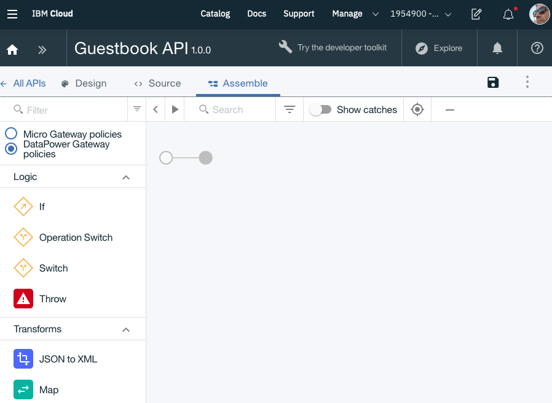

# Lab2 - Secure the Guestbook API with API Connect

1. Create an instance of API Connect on IBM Cloud

	* Sign in to https://cloud.ibm.com/,
	* Go to the [Catalog](https://cloud.ibm.com/catalog),
	* Search the catalog and filter by `api connect`, or filter by Category `Integration`,
	* Click the `API Connect` service,
	* Click `Create`,

2. Create a new API Draft

	* Go to the API Connect Dashboard,
	* Select the default catalog `Sandbox`,
	* From the Home menu, select `Drafts`,

		

	* Select the `APIs` tab,
	* Click the `Add` button > select `Import API from a file or URL` > click the `Select File` button,
	* Browse to your project and select the `api/guestbook-api-swagger.json` file, and select `Open`,
	* Click `Import`,
	* This will create an `API Draft` in the API Designer,
	* Click the `validate` icon in the top right,

		

3. Edit the Draft API

	* Review the Title to be `Guestbook API`,
	* Review the Name to be `guestbook-api`,
	* Review the Version to be `1.0.0`,
	* Go to Scheme and make sure the `https` is checked, API Connect requires https to be used,
	* In the `Base Path` section enter `/`,
	* In the `Consumes` section, check the `application/json` value,
	* In the `Produces` section, check the `application/json` value,
	* In the Paths section, change the `/ping` endpoint to the Loopback generated `/getPing` endpoint,
	* Save the Draft API,


4. Add Assembly to API

	* In the API Designer, in the API Draft, go to the `Assemble` tab,
	* Or in the API Designer go to the `Policy Assembly` section, 
	* Click the `Create assembly` button,
	* You should be in the `Assemble` designer,

		

	* Make sure `DataPower Gateway policies` is selected,
	* Under `Logic`, drag the `Switch` action into the assembly,
    	* Configure the `Switch` action, and for `case 0`, `search operations` and select the `GET /getPing` operation,
    	* Click the `+ Otherwise` button,
  	* Save the Draft API,

		

  	* Loopback created the following endpoints,

		

	* As you see, Loopback 3 prefixes the methods by the Model name. In the assemble, we therefor need to set a variable `lbmodel` to be used as a prefix in the URI of the proxy URL.
    	* Under `Policies`, drag the `Set Variable` into the switch flow for `GET /getPing`,
    	* Click the `+ Action` button,
    	* Under `Set` define the name of the variable as `lbmodel`,
    	* Under `Value` define the value of the model as `Pings`,
		* Save the Draft API,

			

		* Under `Policies`, drag another `Set Variable` into the switch flow for `otherwise`,
		* Click the `+ Action` button,
    	* Under `Set` define the name of the variable as `lbmodel`,
    	* Under `Value` define the value of the model as `Messages`,
    	* Save the Draft API,

			

	* Under `Policies`, drag the `Proxy` action onto the assembly, after the `switch` logic node but before the endnode to capture both the case0 and otherwise workflow,
    	* Configure the `Proxy` action, and add the URL for the Guestbook API service on Kubernetes appended by the contaxt variable `$(request.path)` representing the URI of the request, e.g. `http://remkohdev-cluster-3w.us-south.containers.appdomain.cloud:31356/api/$(lbmodel)$(request.path)`,
    	* Note that the `request.path` includes the starting `/`,
    	* Save the Draft API,

			

	* Test the Draft API, click the `play` icon to test,
	* A `Setup` window will open on the left side,

		

	* Because we do not have a product yet, in the `Or create a new product and publish it to the selected catalog` section, enter a name `Guestbook API`, if you already created the product you can select the product from the `Choose an existing product` dropdown,
	* Click the `Create and publish` button,
	* Click `Next`
	* Click the `Republish product` button,
	* In the `Operation` section, for `Operation` select the `GET /getPing` operation,
	* Click the `Invoke` button

```
# Source: web-terminal/templates/web-terminal-ingress.yaml
apiVersion: extensions/v1beta1
kind: Ingress
metadata:
  name: terminal-ingress
  annotations:
    ingress.bluemix.net/rewrite-path: "serviceName=terminal-service-1 rewrite=/;serviceName=terminal-service-2 rewrite=/;serviceName=terminal-service-3 rewrite=/;"
    ingress.bluemix.net/proxy-connect-timeout: "serviceName=terminal-service-1 timeout=75s;serviceName=terminal-service-2 timeout=75s;serviceName=terminal-service-3 timeout=75s;"
    ingress.bluemix.net/proxy-read-timeout: "serviceName=terminal-service-1 timeout=3600s;serviceName=terminal-service-2 timeout=3600s;serviceName=terminal-service-3 timeout=3600s;"
    kubernetes.io/ingress.class: nginx
spec:
  tls:
  - hosts:
    - testing-cluster.us-east.containers.appdomain.cloud
    secretName: testing-cluster
  rules:
  - host: testing-cluster.us-east.containers.appdomain.cloud
    http:
      paths:
      - path: "/term1"
        backend:
          serviceName: "terminal-service-1"
          servicePort: 80
      - path: "/term2"
        backend:
          serviceName: "terminal-service-2"
          servicePort: 80
      - path: "/term3"
        backend:
          serviceName: "terminal-service-3"
          servicePort: 80
```

1. Create a new Product

	* In the API Designer, in the Draft API, in the top right, click the menu drop down > click the `Generate a default product` option,
	* Change the title to `Guestbook API`,
	* click the `Create product`,
	* Click `All APIs` and go to `Products`,
	* Click the `Guestbook API 1.0.0` to edit the product,
	* 


http://169.63.218.104:30569$(request.path)