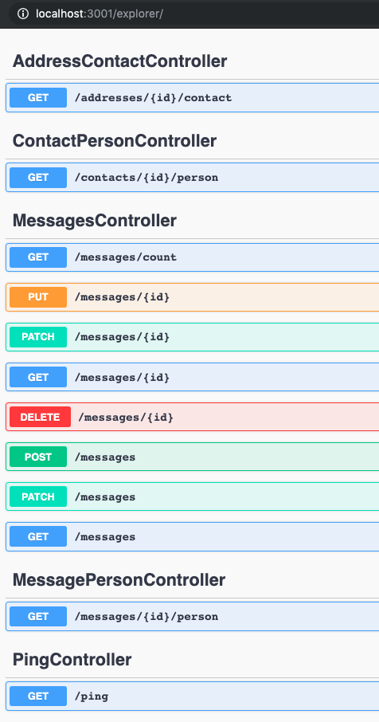

# Lab0 - Create the Guestbook API App using Loopback

1. Pre-requirements

	* Loopback 4 CLI
	* APIC CLI
	* IBM Cloud CLI
	* Bash

2. Setup
   
	* Create the project directory

		```console
		$ mkdir guestbook101
		$ cd guestbook101
		```

3. Get the Guestbook UI source code

	```console
	$ git clone https://github.com/IBM/guestbook.git
	$ cd guestbook/v2/guestbook
	$ docker stop guestbook-web
	$ docker rm guestbook-web
	$ docker build --no-cache -t guestbook-web .
	$ docker run -d --restart always --name guestbook-web -p 3000:3000 guestbook-web
	$ cd ../../..
	```

4. Create the Guestbook API

	* Create the Loopback 4 project for the Guestbook API, and run the app on port 3001, because the UI is already running on port 3000,

		```console
		$ lb4 guestbook-api
		$ cd guestbook-api
		$ PORT=3001 npm start
		```

	* Loopback already added a Dockerfile to your application, on line 25 change the PORT environment variable to 3001,
	* Run the app with Docker,

		```console
		$ docker stop guestbook-api
		$ docker rm guestbook-api
		$ docker build --no-cache -t guestbook-api .
		$ docker run -d --restart always --name guestbook-api -p 3001:3001 guestbook-api
		```

5. Generate the Guestbook data models using the [Model generator](https://loopback.io/doc/en/lb4/Model-generator.html),

	* Add Message model:
    	* id: number, id property, required
    	* text: string, required
    	* datecreated: date, optional

		```console
		$ lb4 model
		? Model class name: Message
		? Please select the model base class Entity (A persisted model with an ID)
		? Allow additional (free-form) properties? No
		Model Message will be created in src/models/message.model.ts

		Let's add a property to Message
		Enter an empty property name when done

		? Enter the property name: id
		? Property type: number
		? Is id the ID property? Yes
		? Is it required?: No
		? Default value [leave blank for none]: 

		Let's add another property to Message
		Enter an empty property name when done

		? Enter the property name: text
		? Property type: string
		? Is it required?: Yes
		? Default value [leave blank for none]: 

		Let's add another property to Message
		Enter an empty property name when done

		? Enter the property name: datecreated
		? Property type: date
		? Is it required?: No
		? Default value [leave blank for none]: 

		Let's add another property to Message
		Enter an empty property name when done

		? Enter the property name: 
		create src/models/message.model.ts
		update src/models/index.ts

		Model Message was created in src/models/
		```
	
	* Add the Person model:
    	* id: number, id property, optional
    	* firstname: string, optional
    	* lastname: string, optional
    	* username: string, optional

		```console
		$ lb4 model
		? Model class name: Person
		? Please select the model base class Entity (A persisted model with an ID)
		? Allow additional (free-form) properties? No
		Model Person will be created in src/models/person.model.ts

		Let's add a property to Person
		Enter an empty property name when done

		? Enter the property name: id
		? Property type: number
		? Is id the ID property? Yes
		? Is it required?: No
		? Default value [leave blank for none]: 

		Let's add another property to Person
		Enter an empty property name when done

		? Enter the property name: firstname
		? Property type: string
		? Is it required?: No
		? Default value [leave blank for none]: 

		Let's add another property to Person
		Enter an empty property name when done

		? Enter the property name: lastname
		? Property type: string
		? Is it required?: No
		? Default value [leave blank for none]: 

		Let's add another property to Person
		Enter an empty property name when done

		? Enter the property name: username
		? Property type: string
		? Is it required?: No
		? Default value [leave blank for none]: 

		Let's add another property to Person
		Enter an empty property name when done

		? Enter the property name: 
		create src/models/person.model.ts
		update src/models/index.ts

		Model Person was created in src/models/
		```
  
	* Add the Contact model:
        * id: number, id property, required
    	* email: string, optional
    	* phone: string, optional

		```console
		$ lb4 model
		? Model class name: Contact
		? Please select the model base class Entity (A persisted model with an ID)
		? Allow additional (free-form) properties? No
		Model Contact will be created in src/models/contact.model.ts

		Let's add a property to Contact
		Enter an empty property name when done

		? Enter the property name: id
		? Property type: number
		? Is id the ID property? Yes
		? Is it required?: No
		? Default value [leave blank for none]: 

		Let's add another property to Contact
		Enter an empty property name when done

		? Enter the property name: email
		? Property type: string
		? Is it required?: No
		? Default value [leave blank for none]: 

		Let's add another property to Contact
		Enter an empty property name when done

		? Enter the property name: phone
		? Property type: string
		? Is it required?: No
		? Default value [leave blank for none]: 

		Let's add another property to Contact
		Enter an empty property name when done

		? Enter the property name: 
		create src/models/contact.model.ts
		update src/models/index.ts

		Model Contact was created in src/models/
		```

	* Add the Address model:
        * id: number, id property, required
    	* addressline1: string, optional
    	* adressline2: string, optional
    	* city: string, optional
    	* state: string, optional
    	* zipcode: string, optional
    	* country: string, optional

		```console
		$ lb4 model
		? Model class name: Address
		? Please select the model base class Entity (A persisted model with an ID)
		? Allow additional (free-form) properties? No
		Model Address will be created in src/models/address.model.ts

		Let's add a property to Address
		Enter an empty property name when done

		? Enter the property name: id
		? Property type: number
		? Is id the ID property? Yes
		? Is it required?: No
		? Default value [leave blank for none]: 

		Let's add another property to Address
		Enter an empty property name when done

		? Enter the property name: addressline1
		? Property type: string
		? Is it required?: No
		? Default value [leave blank for none]: 

		Let's add another property to Address
		Enter an empty property name when done

		? Enter the property name: addressline2
		? Property type: string
		? Is it required?: No
		? Default value [leave blank for none]: 

		Let's add another property to Address
		Enter an empty property name when done

		? Enter the property name: city
		? Property type: string
		? Is it required?: No
		? Default value [leave blank for none]: 

		Let's add another property to Address
		Enter an empty property name when done

		? Enter the property name: state
		? Property type: string
		? Is it required?: No
		? Default value [leave blank for none]: 

		Let's add another property to Address
		Enter an empty property name when done

		? Enter the property name: zipcode
		? Property type: string
		? Is it required?: No
		? Default value [leave blank for none]: 

		Let's add another property to Address
		Enter an empty property name when done

		? Enter the property name: country
		? Property type: string
		? Is it required?: No
		? Default value [leave blank for none]: 

		Let's add another property to Address
		Enter an empty property name when done

		? Enter the property name: 
		create src/models/address.model.ts
		update src/models/index.ts

		Model Address was created in src/models/
		```
	
	* You now have created data models for:
    	* Message
    	* Person
    	* Contact
    	* Address

6. Create a DataSource,
   
    * To add relations to models as Persistent Entity, you must first create a repository for the models. But to create a repository for a Persistent Entity, you must first create a DataSource.
    * For now, I will create a simple in-memory DataSource,

		```console
		$ lb4 datasource
		? Datasource name: db
		? Select the connector for db: In-memory db (supported by StrongLoop)
		? window.localStorage key to use for persistence (browser only): 
		? Full path to file for persistence (server only): 
		create src/datasources/db.datasource.json
		create src/datasources/db.datasource.ts
		update src/datasources/index.ts

		Datasource Db was created in src/datasources/
		```

	* I did not define file and full path for persistence, but add a file name to persist the `in-memory' data,
   
7. Add `in-memory` Repositories,

	* Now you have a DataSource, you can create the Repository.
	* Select datasource `DbDatasource`, select all 4 data models: Address, Contact, Message, Person, and the `DefaultCrudRepository` as repository base class,
  
		```console
		$ lb4 repository
		? Please select the datasource DbDatasource
		? Select the model(s) you want to generate a repository Address, Contact, Message, Person
		? Please select the repository base class DefaultCrudRepository (Legacy juggler bridge)
		create src/repositories/address.repository.ts
		create src/repositories/contact.repository.ts
		create src/repositories/message.repository.ts
		create src/repositories/person.repository.ts
		update src/repositories/index.ts
		update src/repositories/index.ts
		update src/repositories/index.ts
		update src/repositories/index.ts

		Repositories AddressRepository, ContactRepository, MessageRepository, PersonRepository were created in src/repositories/
		```

8. Add relations between the data models,

    *  A Message belongs to a Person

		```console
		$ lb4 relation
		? Please select the relation type belongsTo
		? Please select source model Message
		? Please select target model Person
		? Source property name for the relation getter personId
		identical src/controllers/message-person.controller.ts
		```

    *  A Contact belongs to a Person, and
  
		```console
		$ lb4 relation
		? Please select the relation type belongsTo
		? Please select source model Contact
		? Please select target model Person
		? Source property name for the relation getter personId
		create src/controllers/contact-person.controller.ts

		Relation BelongsTo was created in src/
		```

    *  An Address belongs to a Contact,

		```console
		$ lb4 relation
		? Please select the relation type belongsTo
		? Please select source model Address
		? Please select target model Contact
		? Source property name for the relation getter contactId
		create src/controllers/address-contact.controller.ts

		Relation BelongsTo was created in src/
		```

9. Add Controllers for the data models,

	* Now you can add controllers to implement the logic for the endpoints we want to expose,
	* The first endpoint I want to expose is an API for the Message resources,
  
		```console
		$ lb4 controller
		? Controller class name: Messages
		Controller Messages will be created in src/controllers/messages.controller.ts

		? What kind of controller would you like to generate? REST Controller with CRUD functions
		? What is the name of the model to use with this CRUD repository? Message
		? What is the name of your CRUD repository? MessageRepository
		? What is the name of ID property? id
		? What is the type of your ID? number
		? What is the base HTTP path name of the CRUD operations? /messages
		create src/controllers/messages.controller.ts
		update src/controllers/index.ts

		Controller Messages was created in src/controllers/
		```

    * Run your application,

		```console
		docker stop guestbook-api
		docker rm guestbook-api
		docker build --no-cache -t guestbook-api .
		docker run -d --restart always --name guestbook-api -p 3001:3001 guestbook-api
		```

	* Visit the /explorer to see the created endpoints,

		

10. Test
   
   ```console
   $ curl -X POST "http://localhost:3001/messages" -H "accept: application/json" -H "Content-Type: application/json" -d "{\"text\":\"hello1\",\"datecreated\":\"2019-09-09T15:39:35.357Z\"}"
   ```

11. OpenAPI spec,

	* The OpenAPI spec is available at:
    	* In JSON format: http://localhost:3000/openapi.json,
    	* In YAML format: http://localhost:3000/openapi.yaml, 


